<h1 align="center">Hi 👋, I'm Fajle Imam</h1>

<h3 align="center">
Cybersecurity Enthusiast • Digital Forensics • Cybercrime Investigation
</h3>

---

# 💫 About Me

- 🔐 Cybersecurity Enthusiast
- 🎓 Computer Science & Engineering Undergraduate
- 🕵️ Interested in **Digital Forensics & Cybercrime Investigation**
- 🌐 Interested in **Network Security & OSINT**
- 🚨 Interested in **Incident Response & Threat Investigation**
- ⚡ Love building practical cybersecurity tools

 

---

# 🌐 Connect With Me

---

# 💻 Tech Stack

### Security Tools

### Programming

### Security & Networking

### Tools

---

# 🚀 Projects

### 🛡️ PhishGuard-AI

**AI-based Phishing URL Detection System • 2026**

- Developed an AI-based phishing detection system to identify and classify malicious URLs.
- Analyzed network traffic and security events to identify potential threats.

---

### 🔎 Port Scanner

**Python-based Networking Security Tool • 2026**

- Built a Python-based port scanner to identify open ports on target systems.
- Implemented socket programming to scan multiple ports and detect active services.

---

### 💻 BT-Ducky Commander

**Security Automation Demonstration Tool • 2025**

- Developed a proof-of-concept automation tool inspired by USB Rubber Ducky.
- Designed scripted workflows to demonstrate security automation techniques.

---

# 📊 GitHub Stats

---

# 🔥 GitHub Streak

---

# 📈 Contribution Graph

---

# 🐍 Contribution Snake

---

# 📈 Profile Summary

---

# ✍️ Dev Quote

---

